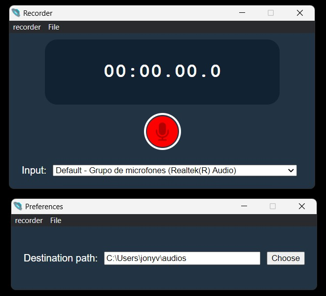

# Gravador de áudio Electron



## Como usar

Para clonar e rodar esse repositório você vai precisar ter o [Git](https://git-scm.com) e o [Node.js](https://nodejs.org/en/download/) instalados. 


No seu terminal:

``` bash
# Clone esse repositório
git clone https://github.com/JVMC42/GravadorElectron
#Vá para a pasta do repositório
cd GravadorElectron
# Instale as dependências e rode o app
npm install && npm start
```

Caso queira fazer o build:

``` shell
npm run dist
```
